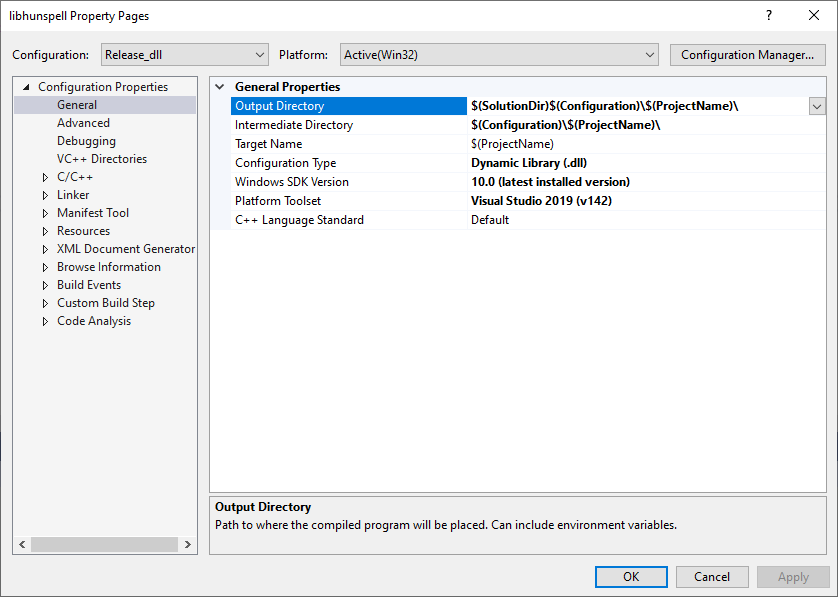

[Source project](https://github.com/hunspell/hunspell)

* Built with Visual Studio 2019
* Project changes
  * Clone latest from GitHub: `https://github.com/hunspell/hunspell` 
  * In the Solution Explorer, change from the default Folder View to Solution Explorer for Hunspell.sln
  * Right click the `libhunspell` project and bring up properties
  * Set the active build config
    * `Release_dll`
  * Change the configuration type  
    * `Dynamic Library (.dll)`
  * Change Windows SDK version target to the latest version installed on your machine 
    * `10.0 (latest installed version)`
  * Change Platform Toolset (build tools) to the latest 
    * `Visual Studio 2019 (v142)`
  * Build the Release_dll Win32 target to generate `libhunspell.dll`
  
  

  